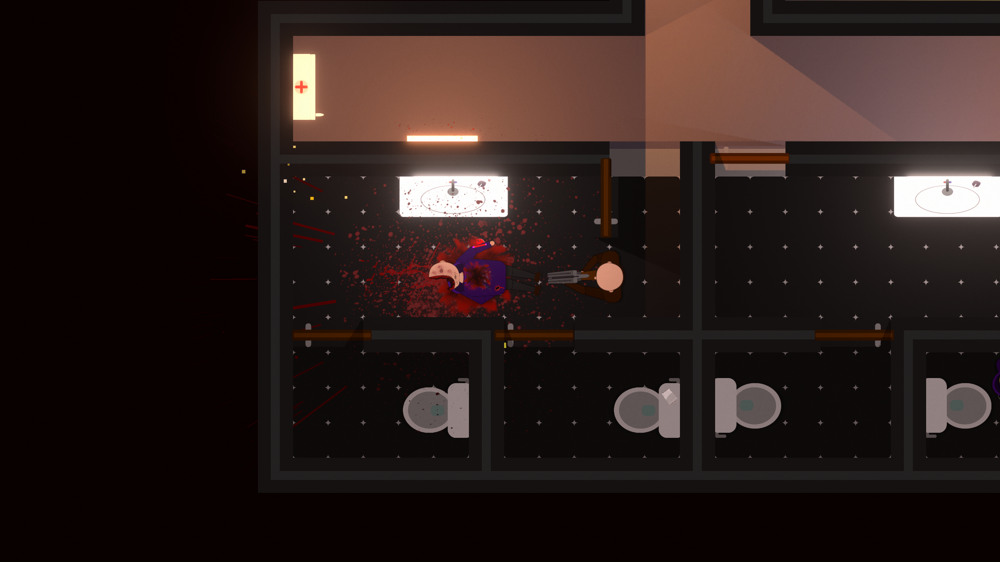
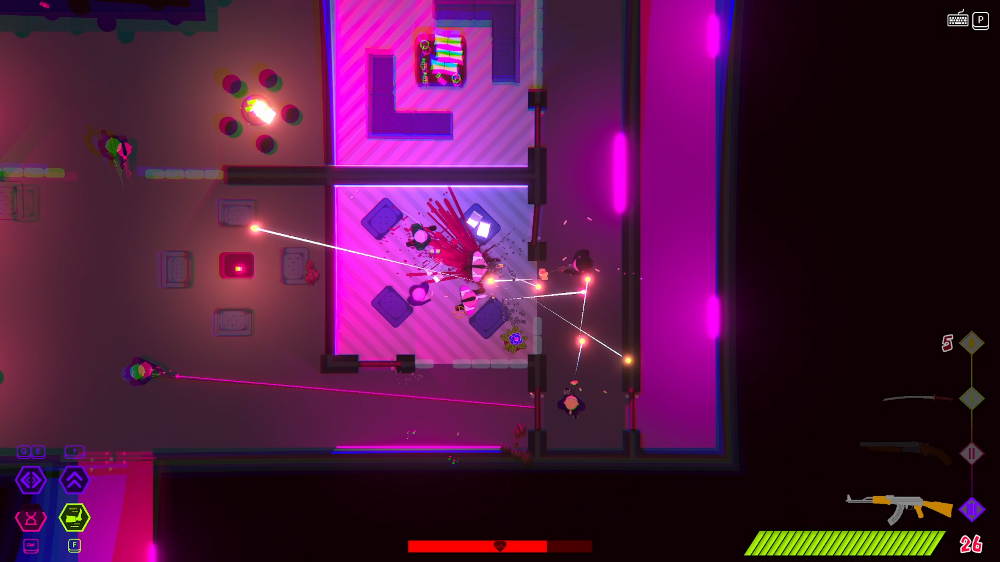
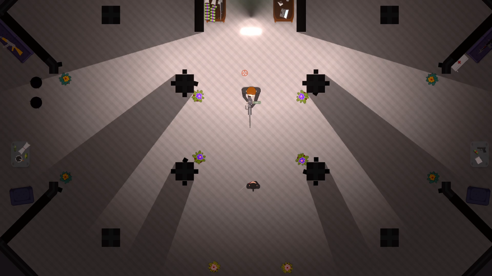
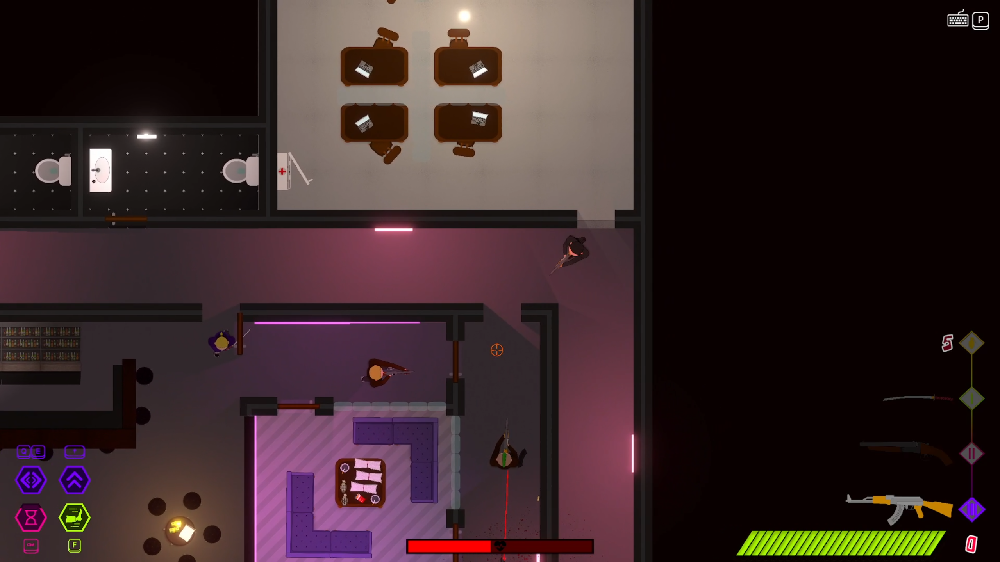
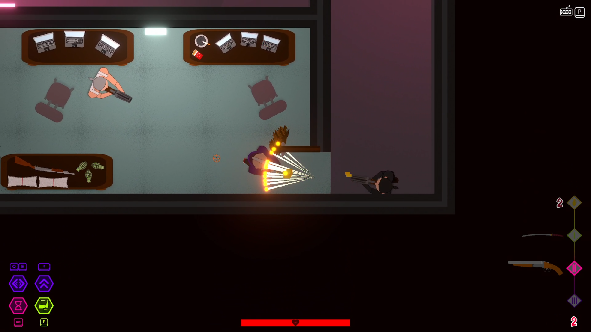
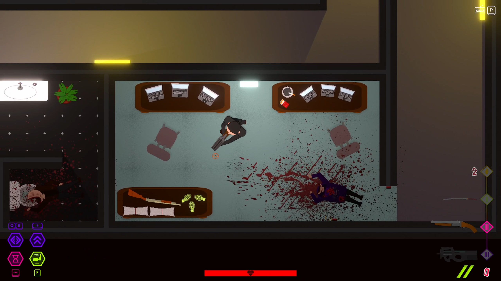
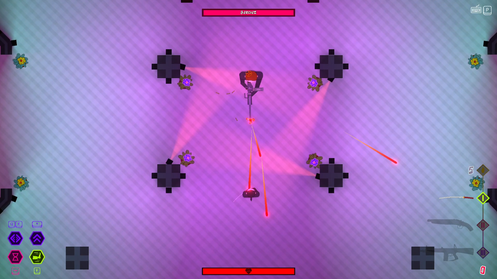
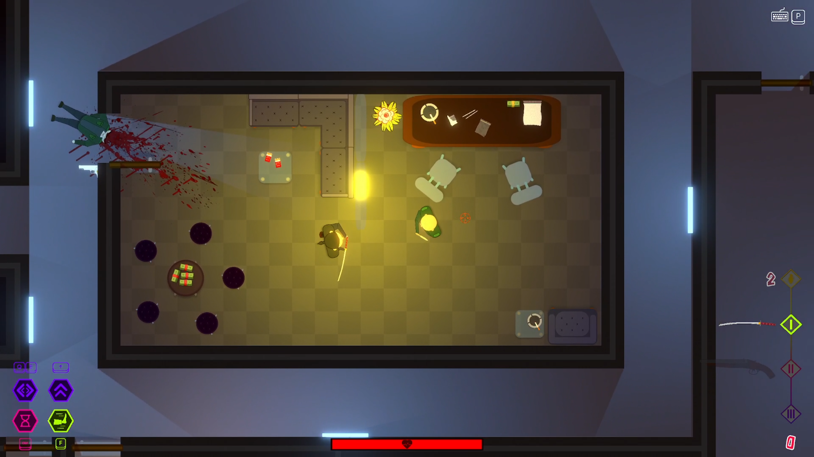
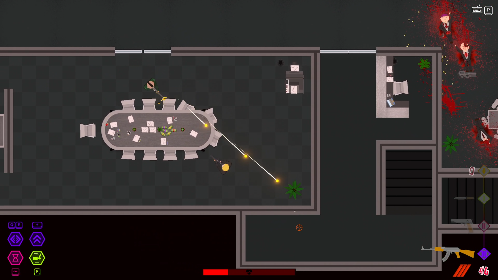

# Fools Game

[Download demo build](https://mega.nz/folder/DAEC1QDD#WIKLTGUpiiyVHaSZVCjkDQ)

---

## Game Description
**Fools Game** is a 2D top-down shooter inspired by titles like *Hotline Miami* and *OTXO*.  
It’s a fast-paced, adrenaline-fueled game with a story about revenge.  

Players navigate through groups of rooms filled with reactive enemies.  
They can either fight their way directly through or try to sneak around to attack enemies from behind using melee weapons for stealth takedowns.  

Each level is designed to challenge reflexes and strategic thinking.  

---

## My Contributions
I worked on almost every aspect of the game except music, voiceovers, and some sound effects:  
- **Gameplay and logic:** character movement (dodging, dashing, kicking, slow motion), shooting mechanics, weapon system (different weapon types, ammo, realistic reloading logic, environment bullet penetration system), health and damage systems, environment interactions.  
- **Enemy AI:** enemy behavior, reactions to the player, various movement and attack patterns.  
- **Effects and animations:** shooting effects, environmental effects, hit and explosion visuals, character, enemy, and weapon animations, lighting system.  
- **Graphics:** vector graphics, level design, visual consistency.  
- **System integration:** connecting gameplay, animations, effects, and other elements into a playable and cohesive experience.  

---

## External Assets and References
- **Sounds and music:** taken from freely available sources  
- **AI voiceovers:** generated with AI tools  

### References / Sources
| Type | Description / Source | Link |
|------|--------------------|------|
| Music | Music for levels | [https://www.youtube.com/@AimToHeadOfficial] |
| Sounds | Sound effects | [https://pixabay.com/cs/users/freesound_community-46691455/] |
| Voiceovers | AI-generated character voices | [https://elevenlabs.io] |

> All external assets are used for **non-commercial purposes only**; this is a portfolio project.  

---

## Video Walkthrough

The Club -  [https://img.youtube.com/vi/yrXJghZ3A5U/0.jpg]

Unfinished Levels - [https://img.youtube.com/vi/yrXJghZ3A5U/0.jpg]

---

## Screenshots

---